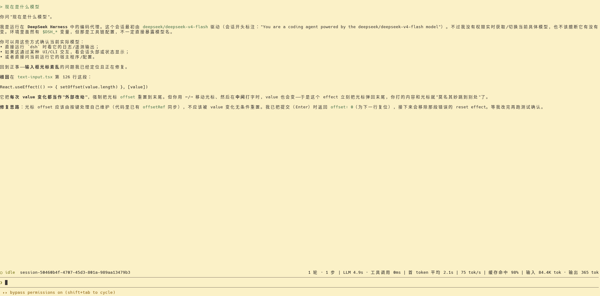

# dsh cli — 交互式终端 Agent

[English](README.md) | 中文

`dsh cli` 是一个**交互式终端 agent**，fork 自 [DeepSeek Harness](https://github.com/deepseek-ai/deepseek-harness) 并聚焦于 CLI 使用：在终端里获得像 [Claude Code](https://docs.anthropic.com/en/docs/claude-code) 那样的编码体验——全屏 UI、流式输出、工具卡、会话历史、权限控制，而无需浏览器。

底层是 DeepSeek Harness 的插件架构（[一切皆插件](https://github.com/cordiverse/cordis)），但此仓库只关注并打磨 `dsh cli` 这一条交互链路。

## 特性

- **Claude Code 式交互**：全屏 alternate screen、输入框固定底部、上下箭头历史导航（含跨会话持久历史）
- **Markdown 终端渲染**：粗体、斜体、代码、列表、标题按终端样式显示
- **工具卡折叠**：相邻工具调用合并为一行，`Ctrl+O` 展开
- **会话统计栏**：轮/步、LLM 耗时、首 token 延迟、吞吐、缓存命中率、输入/输出 tokens
- **权限徽章**：`Shift+Tab` 循环 `read-only → workspace-write → danger-full-access`，`danger-full-access` 显示 "bypass permissions"
- **自定义 provider**：指向任意 OpenAI 兼容端点（如 mify），模型路由与 `web_search` 均可配置
- **会话恢复**：重开 `dsh cli` 续上次会话，`/session` 切换
- **热加载开发**：`pnpm dsh:dev`（node --watch）改源码自动重启

## Demo



## 快速开始

要求 Node.js ≥ 22。

```sh
# from source
git clone https://github.com/soolaugust/deepseek-harness-cli.git
cd deepseek-harness-cli
pnpm install
pnpm run build
pnpm dsh cli
```

从 npm：

```sh
npx @deepseek-ai/dsh cli
```

首次启动会创建/恢复一个会话；输入文字回车发送，模型输出流式渲染在输入框上方。

## 使用

| 操作 | 效果 |
| --- | --- |
| 输入文字 + `Enter` | 发送给 agent |
| `↑` / `↓` | 历史导航（跨会话持久） |
| `Shift+Tab` | 循环权限 preset |
| `Ctrl+O` | 展开/收起工具组 |
| `Ctrl+C` | 运行中取消当前回合；提示符下退出 |
| `/exit` `/help` `/clear` `/session` `/model` `/permission` | slash 命令 |

完整说明见 [CLI 指南](docs/user/guide/cli.md)。

## 配置自定义 provider

通过 `~/.dsh/settings.yaml` 指向任意 OpenAI 兼容端点（如 mify、OpenRouter），模型路由和 `web_search` 均可配置。详见 [CLI 指南 · 使用自定义模型提供方](docs/user/guide/cli.md#use-a-custom-model-provider)。

## 开发

```sh
pnpm dsh:dev          # auto-restart on source changes (hot-reload development)
pnpm run test         # unit tests
pnpm run typecheck    # type checks
```

## 继承自 DeepSeek Harness

此仓库是 [DeepSeek Harness](https://github.com/deepseek-ai/deepseek-harness) 的一个 fork，聚焦于其 `dsh cli` 交互式终端能力。完整的多 profile 架构、Web UI、SDK 等仍在 [上游仓库](https://github.com/deepseek-ai/deepseek-harness)。

## 许可证

[MIT](LICENSE)
